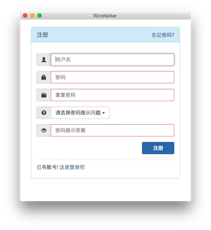
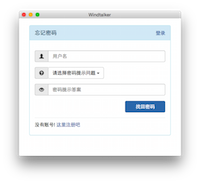
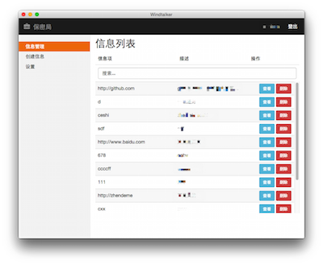
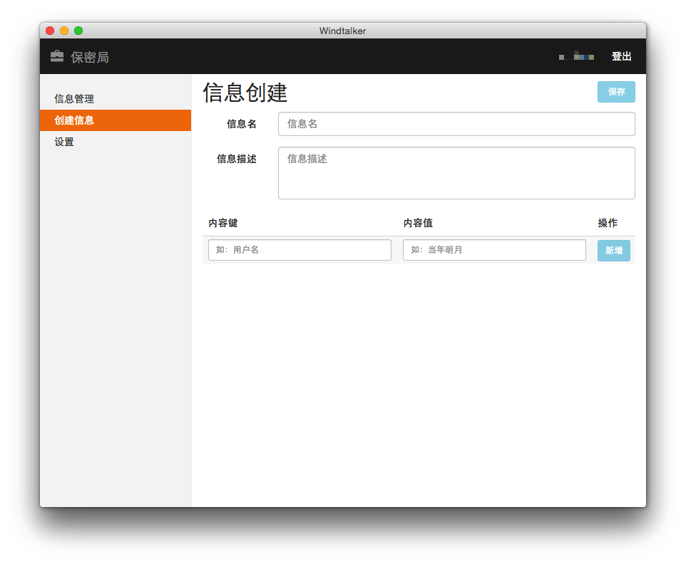
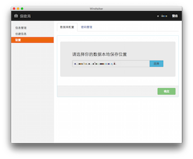

Windtalker
===============

在信息极速膨胀的时代，我们都面临着大量的敏感信息，如：密码等。因为众所周知的一些云存储泄漏丑闻，相信大家都不会放心把自己的众多银行卡密码保存在一个Online的“云”里，随时有可能被盗哦！
有时候，只有自己的电脑，好像才是你最心安的所在。 
`保密局`就是这样一个工具，她将你的“机密”仅仅保存在你指定的位置，当然可以是本地磁盘、移动硬盘、U盘也可以是网络硬盘。 
经过`保密局`存储到文件数据库的信息都是经过OpenSSL加密的，确保不会被人为破解，所以可以放心使用。

 
 
 

## 本地编译 ##

### 本地编译环境需求 ###

1. [NodeJs](http://nodejs.org)

### 编译 ###

#### Mac ####

1. `sudo npm install gulp -g`
2. `git clone git@github.com:leftstick/windtalker.git`
3. `cd windtalker`
4. `gulp release`

#### Windows ####

1. `npm install gulp -g`
2. `git clone git@github.com:leftstick/windtalker.git`
3. `cd windtalker`
4. `gulp release`

> 编译后的可执行文件在`build/windtalker／<OS>/`下，双击`windtalker.app`或者`windtalker.exe`即可打开